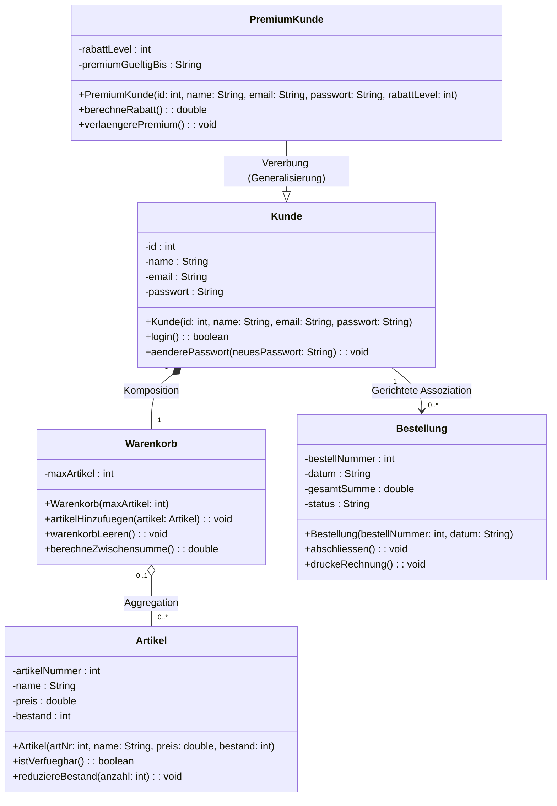

```mermaid
classDiagram
    class Kunde {
        -id : int
        -name : String
        -email : String
        -passwort : String
        +Kunde(id: int, name: String, email: String, passwort: String)
        +login() : boolean
        +aenderePasswort(neuesPasswort: String) : void
    }

    class PremiumKunde {
        -rabattLevel : int
        -premiumGueltigBis : String
        +PremiumKunde(id: int, name: String, email: String, passwort: String, rabattLevel: int)
        +berechneRabatt() : double
        +verlaengerePremium() : void
    }

    class Warenkorb {
        -maxArtikel : int
        +Warenkorb(maxArtikel: int)
        +artikelHinzufuegen(artikel: Artikel) : void
        +warenkorbLeeren() : void
        +berechneZwischensumme() : double
    }

    class Artikel {
        -artikelNummer : int
        -name : String
        -preis : double
        -bestand : int
        +Artikel(artNr: int, name: String, preis: double, bestand: int)
        +istVerfuegbar() : boolean
        +reduziereBestand(anzahl: int) : void
    }

    class Bestellung {
        -bestellNummer : int
        -datum : String
        -gesamtSumme : double
        -status : String
        +Bestellung(bestellNummer: int, datum: String)
        +abschliessen() : void
        +druckeRechnung() : void
    }

    %% Beziehungen
    PremiumKunde --|> Kunde : Vererbung (Generalisierung)
    Kunde "1" *-- "1" Warenkorb : Komposition
    Warenkorb "0..1" o-- "0..*" Artikel : Aggregation
    Kunde "1" --> "0..*" Bestellung : Gerichtete Assoziation
```
