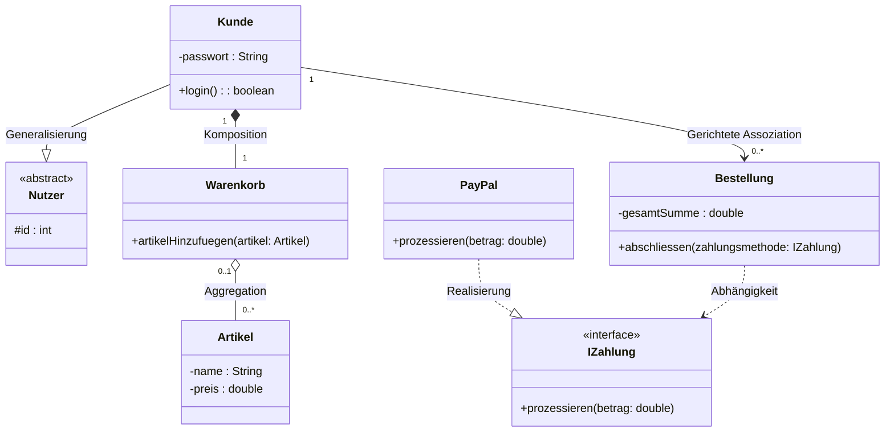

```mermaid
classDiagram
    class Nutzer {
        <<abstract>>
        #id : int
    }

    class Kunde {
        -passwort : String
        +login() : boolean
    }

    class Warenkorb {
        +artikelHinzufuegen(artikel: Artikel)
    }

    class Artikel {
        -name : String
        -preis : double
    }

    class Bestellung {
        -gesamtSumme : double
        +abschliessen(zahlungsmethode: IZahlung)
    }

    class IZahlung {
        <<interface>>
        +prozessieren(betrag: double)
    }

    class PayPal {
        +prozessieren(betrag: double)
    }

    %% Beziehungen
    Kunde --|> Nutzer : Generalisierung
    Kunde "1" *-- "1" Warenkorb : Komposition
    Warenkorb "0..1" o-- "0..*" Artikel : Aggregation
    Kunde "1" --> "0..*" Bestellung : Gerichtete Assoziation
    PayPal ..|> IZahlung : Realisierung
    Bestellung ..> IZahlung : Abhängigkeit
```
